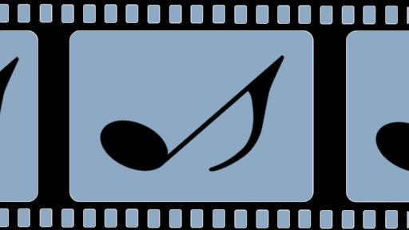

# movieMus 

## Description
Movie soundtracks are a huge part of the movie-watching experience, so discovering their soundtracks and related albums can allow you to find your new favorite songs, or get a better feel for a movie you haven’t seen yet!

MovieMus is a web application that allows you to view soundtracks and related albums to your favorite movies.

Try out the app [HERE](https://ayodejiamosun.github.io/Project-1/) 

---
## User Story
```
AS an individual who enjoys movies and music
I WANT an application that can show me artists and albums related to movies I have seen or want to see
SO THAT I don't have to use multiple websites or applications to find out the songs that are in my favorite movies
```
---
## Table of Contents
[Creation](#creation)

[Installation](#installation)

[Usage](#usage)

[Collaborators](#collaborators)

---
## Creation

### Technologies
The front-end of the application uses HTML, CSS, Bootstrap, JavaScript, and API's from OMDB and iTunes.

The back-end of the application uses javascript, AJAX and jQuery.

---
## Installation
### For local installation
1. Fork app from [HERE](https://github.com/ayodejiamosun/Project-1)
2. Save application locally
3. Select index.html and open in default browser

---
## Collaborators
Steven Johnson:
[LinkedIn](https://www.linkedin.com/in/stevenjohnson87/),
[Portfolio](https://stevejohnson.herokuapp.com/projects),
[GitHub](https://github.com/StevenJ87)

Ayodeji Amosun:
[LinkedIn](https://www.linkedin.com/in/ayodeji-amosun-599296196/),
[GitHub](https://github.com/ayodejiamosun)

Al Patino:
[GitHub](https://github.com/AlPatino98)
___